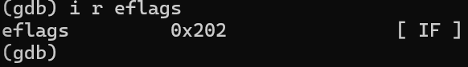

add1.asm

the IF(Interrupt flag) is initially set
that means that the system allows for maskable interupts, this is et by the hardware and not the program

final flags [ PF AF SF IF OF]
PF - result has even parity
AF - carry between bit 3 and 4 (was useful for BCD, doesn't affect current operation)
SF - most significant bit is 1 
OF - if the numbers were signed, then the result would be beyond the limit of the register -127 to +128

add3.asm

IF is initally set

final flags [ CF PF AF ZF IF]
CF - carry out of the most significant bit (for unsigned numbers)
PF - even number of 1's
AF - carry between bit 3 and 4 (it stays there regardless of the number of bits in the number)
ZF - result is a 0

OF was not set because if the numbers were signed, then they would still be between the accepted range

