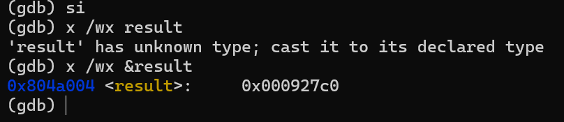

## mul1.asm

**[IF]** is initially set to allow maskable interrupts to be serviced

register `eax` has **250** which is the correct answer

**[PF SF IF]** flags were set

* **PF** - the final result had even parity
* **SF** - the most significant bit was a 1
* **IF** - was already set

The determining flags are **OF and CF** which are set in unison to show that the result did not fit in the inital operand size i.e 1 byte

## mul2.asm

After multiplication, `ax` has **10176**, `dx` has **9**.

The result was not able to fit in the initial defined `dw` and spanned both `ax:dx`

**[CF PF IF OF]**

* **CF and OF** are set together because the result spanned more than the original `dw` of the operands
* **PF** is for even parity
* **IF** is automatically set

